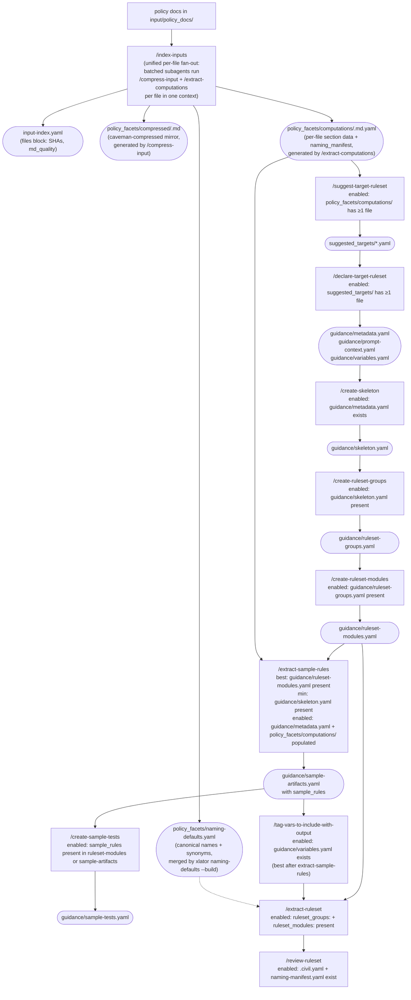

## Environment variables

The `.xlator.local.env` file exports the `$DOMAINS_DIR` and other environment variables, used by shell scripts and AI skills.

If `$DOMAINS_DIR` is unknown, read it from `.xlator.local.env` in the project root folder.

`$DOMAINS_DIR` is relative the project root. The Xlator Claude Code plugin modifies files only under the `$DOMAINS_DIR` folder.

**`XLATOR_AI_CONCURRENCY`** (optional, default `3`) — bounds the per-batch parallelism of `/index-inputs`'s unified per-file fan-out. Each batch dispatches up to K subagent workers in a single assistant turn; the orchestrator waits for the batch before issuing the next. The default of 3 is conservative across Anthropic tiers; raise it (e.g., `XLATOR_AI_CONCURRENCY=8`) once your tier's rate-limit headroom is confirmed. There is no explicit 429 retry/backoff in v1 — if rate-limit errors surface, lower the value or set it to 1.

## Running Python scripts under the tools folder

To run Python scripts under the `tools/` folder, use the `xlator` shell script as a shim so that required environment variables are correctly set.

## Running arbitrary Python code on the CLI

Do not run the `python` or `python3`; instead run `uv run python <args>`.

To install Python libraries or dependencies, use `uv pip install`.

## Project Terminology

Use the project's exact terminology: 'ruleset module' (not 'sub-ruleset', not 'submodule'), 'ruleset group' (not 'workflow stage'), 'CIVIL' for the DSL name. Ask for clarification if domain terminology is ambiguous rather than guessing.

## Index path keys vs content reads

`input-index.yaml` (in `<domain>/policy_facets/`) uses `input/policy_docs/<rel>.md` as its path keys, identifying the source policy doc that was indexed. Source files are the canonical analyst-authored truth.

Downstream skills that need the policy doc *content* (e.g., `/extract-ruleset`, `/update-ruleset`) read the caveman-compressed counterpart at `<domain>/policy_facets/compressed/<rel>.md`.

Downstream skills that need the policy doc *structured section data* (e.g., `/suggest-target-ruleset`, `/create-skeleton`, `/create-ruleset-groups`, `/create-ruleset-modules`, `/extract-sample-rules`, `/refine-guidance`) glob `<domain>/policy_facets/computations/**/*.md.yaml`. Each per-file file is a YAML map with two top-level keys: `naming_manifest:` (a `variables:` map of every variable name surfaced in the file with its verbatim `policy_phrase:` and optional `role_hint:` and `source_section:`) and `sections:` (a list of `{heading, summary, tags, phase?, phase_source?, computations?}` section blocks — same shape as the prior list-of-sections format). Consumers that only care about section data read `data["sections"]`. The source path is encoded in the filename — a per-file file at `policy_facets/computations/<rel>.md.yaml` describes the source at `input/policy_docs/<rel>.md`. Readers reconstitute the `path:` field by stripping the trailing `.yaml` suffix from the per-file file's relative path under `policy_facets/computations/` and prefixing with `input/policy_docs/`. There is no `path:` field inside the per-file files.

**Cross-file naming consistency.** `/index-inputs` runs `xlator naming-defaults --build` after the per-file extract finalize, merging every per-file `naming_manifest:` block into `<domain>/policy_facets/naming-defaults.yaml` (a flat `variables:` map of canonical names + `synonyms:` + `role_hint:` + `sources:`). The merge tool also rewrites in place any per-file `sections[*].computations[*].variables` lists whose names changed during canonicalization, so all downstream consumers see one agreed-upon name per concept. Workers read a three-level authority chain on every run — `specs/naming-manifest.yaml` (highest, analyst-confirmed) → `policy_facets/naming-defaults.yaml` (mid, auto-picked) → `core/naming_guide.md` (lowest, static style rules). When `/extract-ruleset` Step 7 writes a rename to `specs/naming-manifest.yaml`, it sets `original_name:` to the prior canonical (preserving the earliest anchor across rename chains); the next `/index-inputs` run flows that rename through the worker authority chain — analysts never copy renames back manually.

**Section-block field semantics.** `phase:` is a snake_case identifier naming the phase or stage of analysis the section belongs to (e.g., `initial_screening`, `deductions`); `/extract-computations` populates it only when the source doc surfaces an explicit phase or stage signal in heading text, body text, or an attributable ancestor heading. `phase_source:` is the verbatim source-text quote that justified the phase identifier — paired with `phase:` (both fields ship together or both are absent). The verbatim quote enables on-demand verification: `grep -F "<phase_source>" <input/policy_docs/<rel>.md>` proves the AI honored the explicit-signal rule. **The per-section `phase:` field is unrelated to CIVIL's `RulesetGroup.description` "evaluation phase" wording in `xl-plugin/core/ruleset.schema.json` / `xl-plugin/tools/civil_schema.py` — they share the English word but are different controlled-vocabs.** The per-section `phase:` is a pre-derivation signal feeding `/create-ruleset-groups` → `guidance/ruleset-groups.yaml` → `/extract-ruleset`; CIVIL's `RulesetGroup` is the compiled output. `phase:` is single-owner: only `/extract-computations` writes it; consumer skills read but never modify or invent it.

`/index-inputs` itself continues to scan `input/policy_docs/` for SHA and md_quality scoring — its index reflects the source files, not the compressed copies and not the computations files.

The per-file `<rel>.md.yaml` filename is intentional: the source filename (including its `.md` extension) is preserved verbatim and `.yaml` is appended so editor syntax highlighting and `find -name '*.yaml'` filters pick the files up as YAML.

## Output Fencing

All skill output MUST be wrapped in semantic fence blocks so a web UI harness can parse and route it without AI or heuristics. Always include the fencing syntax around the text blocks in the output, such as `:::important` and `:::next_step`.

**Syntax:** `:::type` on its own line to open, `:::` on its own line to close. No nesting. Multiple blocks per response are allowed.

| Fence type | When to use |
|------------|-------------|
| `:::important` | Primary result, written confirmation, summary verdict |
| `:::error` | Pre-flight failure — always paired with a stop |
| `:::next_step` | Suggested follow-on skills after successful completion |
| `:::detail` | Skeleton, YAML, rule tables, coverage maps, verbatim relay output |
| `:::progress` | In-flight status lines, scan progress, step checklist mid-run |
| `:::user_input` | Any prompt requiring a user response before continuing |

Unfenced output defaults to `detail`.

**`progress` vs `detail`:** `:::progress` = transient, in-flight (still running). `:::detail` = complete, available for inspection.

**Verbatim-relay:** Open `:::detail` before beginning relay; close `:::` after relay completes. One fence per program — do not wrap multiple programs in a single fence.

Before executing any skill, read `core/output-fencing.md` for the full authoring reference.

## Skills Next steps

After completion of a `xl` skill, suggest possible next steps based on the following workflows:

Typical steps:
  1. `/new-domain <domain>` to set up the folder scaffold for a new domain
  2. User adds `.md` policy documents to `$DOMAINS_DIR/<domain>/input/policy_docs/`
  3. `/index-inputs <domain>` to build a document index
  4. Write an AI prompt to extract a ruleset in the `guidance/` folder — two options:
      * **Monolithic (original):** `/refine-guidance <domain>`
      * **Step-by-step (for UI-driven or incremental workflows):**
        - `/suggest-target-ruleset <domain>` — analyze the document index and write candidate target rulesets to files for user selection
        - `/declare-target-ruleset <domain>` — write initial `guidance/` files from a specified target ruleset file (one of the files created by `/suggest-target-ruleset`)
        - `/create-skeleton <domain>` — extract doc signals from the document index and build the computation skeleton
        - `/create-ruleset-groups <domain>` — propose ruleset groups that group related computations in the skeleton; these groups will help with ruleset visualizations
        - `/create-ruleset-modules <domain>` — apply heuristics to detect ruleset modules to further consolidate computations within groups; these modules will become reusable ruleset modules in the target ruleset language
        - `/extract-sample-rules <domain>` — generate sample CIVIL rules from the index (best after create-ruleset-modules) for the user to become familiar, revise, and gain confidence in the anticipated results
        - `/tag-vars-to-include-with-output <domain>` — auto-detect intermediate computed variables to be exposed along with the final output (best after extract-sample-rules); the selected variables are intended to be useful for explaining the computations used to derive the final output
        - `/create-sample-tests <domain>` — generate sample test cases to measure the accuracy of the generated ruleset; this gives the AI a metric to assess and correct the generated ruleset
  5. `/extract-ruleset <domain>` to extract the CIVIL ruleset
  6. `/review-ruleset <domain>` to review the extracted ruleset, finalize graph artifacts, and capture guidance learnings

### Skill dependency diagram

Enable/disable each skill in the UI based on which file-state prerequisites are satisfied. Dashed edges indicate optional steps — the downstream skill is enabled independently, not gated on them.



**`/tag-vars-to-include-with-output` is required before `/extract-ruleset`** in a UI-driven workflow — it populates `include_with_output` so SP-TagOutputs has pre-selections and doesn't block for interactive input. Skipping it causes `/extract-ruleset` to prompt mid-run.

**`/create-sample-tests` is optional** — `/extract-ruleset` does not read `sample_tests:`. These are planning scaffolding only.

- `extract-sample-rules` can run earlier (after `create-skeleton` minimum) but produces flat, ungrouped output without `ruleset_modules:`
- `tag-vars` can run earlier but misses invoke-derived variables only visible in CIVIL snippets
- `create-sample-tests` always follows `extract-sample-rules`

Once `/review-ruleset` completes (or whenever the ruleset changes), the user can choose to:
  * `/create-demo <domain>` to generate a web-based ruleset demo
  * `/create-tests <domain>` to create an initial set of test cases

After test cases are created or modified, the user can choose to:
  * `/transpile-and-test <domain>` to transpile to default output language (Catala) and run the test cases
  * `/expand-tests <domain>` to increase test coverage
  * Add manually-created tests to the `$DOMAINS_DIR/<domain>/specs/tests` folder

After the user adds/updates .md policy documents in `$DOMAINS_DIR/<domain>/input/policy_docs/`, they should:
  1. `/index-inputs <domain>` to update the document index
  2. `/update-ruleset <domain>` to update the CIVIL ruleset

## Multi-step Skills

When a skill has more than 3 steps, show a checklist of the steps at the completion of each step to help the user track their progress.

## AskUserQuestion

When asking the user a question, never present the option of "Press Enter to ...".
Instead, if the question expects a boolean response, then show "[y/n]".
If there are multiple response options, present it as:

```
[a] Option one
[b] Option two
[c] Option three
(or type in difference response)
```

If the user responds with more than 1 character, then use the user's response as the answer.

## Catala Conventions

When working with Catala code, always use Catala semantics and syntax — never Rego. Double-check that generated tests, transpiler output, and examples use Catala conventions (e.g., `Using` not `Include`, correct module/entity prefixes).

## Shell Commands

On macOS, do not use `grep -P` (PCRE). Use `grep -E` (extended regex) or `perl -ne` instead.
