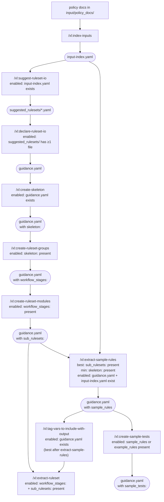

## Environment variables

The `.xlator.local.env` file exports the `$DOMAINS_DIR`, `$CLAUDE_PLUGIN_ROOT`, and `$XLATOR_UV_BASEDIR` environment variables, used by shell scripts and slash commands.

If `$DOMAINS_DIR` is unknown, read it from `.xlator.local.env` in the project root folder.

`$DOMAINS_DIR` is relative the project root. The Xlator Claude Code plugin modifies files only under the `$DOMAINS_DIR` folder.

## Running Python scripts under the tools folder

To run Python scripts under the `tools/` folder, use the `xlator` shell script as a shim so that required environment variables are correctly set.

## Running arbitrary Python code

Do not use the system Python. Use the virtual environment in the `$XLATOR_UV_BASEDIR` folder by using `uv run --directory "$XLATOR_UV_BASEDIR" python <args>`.
To avoid having to use `uv run` for each command line, activate the virtual environment (`. "$XLATOR_UV_BASEDIR/.venv/bin/activate"`) before running the Python code.

## Project Terminology

Use the project's exact terminology: 'sub-ruleset' (not 'submodule'), 'CIVIL' for the DSL name. Ask for clarification if domain terminology is ambiguous rather than guessing.

## Slash Commands Next steps

After completion of a `xl` slash command, suggest possible next steps based on the following workflows:

Typical steps:
  0. `/xl:new-domain <domain>` to set up the folder scaffold for a new domain
  1. User adds `.md` policy documents to `$DOMAINS_DIR/<domain>/input/policy_docs/`
  2. `/xl:index-inputs <domain>` to build a document index
  3. Set extraction goals and ruleset guidance — two options:
      * **Monolithic (original):** `/xl:refine-guidance <domain>`
      * **Step-by-step (for UI-driven or incremental workflows):**
        - `/xl:suggest-ruleset-io <domain>` — analyze the index and suggest candidate rulesets
        - `/xl:declare-ruleset-io <domain>` — bootstrap `guidance.yaml` from a suggestion file
        - `/xl:create-skeleton <domain>` — extract doc signals and build the computation skeleton
        - `/xl:create-ruleset-groups <domain>` — propose and confirm workflow stages
        - `/xl:create-ruleset-modules <domain>` — detect sub-ruleset candidates
        - `/xl:extract-sample-rules <domain>` — generate sample CIVIL rules from the index (best after create-ruleset-modules)
        - `/xl:tag-vars-to-include-with-output <domain>` — auto-detect output-exposed variables (best after extract-sample-rules)
        - `/xl:create-sample-tests <domain>` — generate sample test scaffolding
  4. `/xl:extract-ruleset <domain>` to extract the CIVIL ruleset

### Command dependency diagram

Enable/disable each command in the UI based on which file-state prerequisites are satisfied. Dashed edges indicate optional steps — the downstream command is enabled independently, not gated on them.



**`/tag-vars-to-include-with-output` is required before `/extract-ruleset`** in a UI-driven workflow — it populates `include_with_output` so SP-TagOutputs has pre-selections and doesn't block for interactive input. Skipping it causes `/extract-ruleset` to prompt mid-run.

**`/create-sample-tests` is optional** — `/extract-ruleset` does not read `sample_tests:`. These are planning scaffolding only.

- `extract-sample-rules` can run earlier (after `create-skeleton` minimum) but produces flat, ungrouped output without `sub_rulesets:`
- `tag-vars` can run earlier but misses invoke-derived variables only visible in CIVIL snippets
- `create-sample-tests` always follows `extract-sample-rules`

Once a ruleset exists or whenever the ruleset changes, the user can choose to:
  * `/xl:create-demo <domain>` to generate a web-based ruleset demo
  * `/xl:create-tests <domain>` to create an initial set of test cases

After test cases are created or modified, the user can choose to:
  * `/xl:transpile-and-test <domain>` to transpile to default output language (Catala) and run the test cases
  * `/xl:expand-tests <domain>` to increase test coverage
  * Add manually-created tests to the `$DOMAINS_DIR/<domain>/specs/tests` folder

After the user adds/updates .md policy documents in `$DOMAINS_DIR/<domain>/input/policy_docs/`, they should:
  1. `/xl:index-inputs <domain>` to update the document index
  2. `/xl:update-ruleset <domain>` to update the CIVIL ruleset

## Multi-step Slash Commands

When a slash command has more than 3 steps, show a checklist of the steps at the completion of each step to help the user track their progress.

## AskUserQuestion

When asking the user a question, never present the option of "Press Enter to ...".
Instead, if the question expects a boolean response, then show "(y/n)".
If there are multiple response options, present it as:

```
a. Option one
b. Option two
c. Option three
(or type in difference response)
```

If the user responds with more than 1 character, then use the user's response as the answer.

## Catala Conventions

When working with Catala code, always use Catala semantics and syntax — never Rego. Double-check that generated tests, transpiler output, and examples use Catala conventions (e.g., `Using` not `Include`, correct module/entity prefixes).

## Shell Commands

On macOS, do not use `grep -P` (PCRE). Use `grep -E` (extended regex) or `perl -ne` instead.
